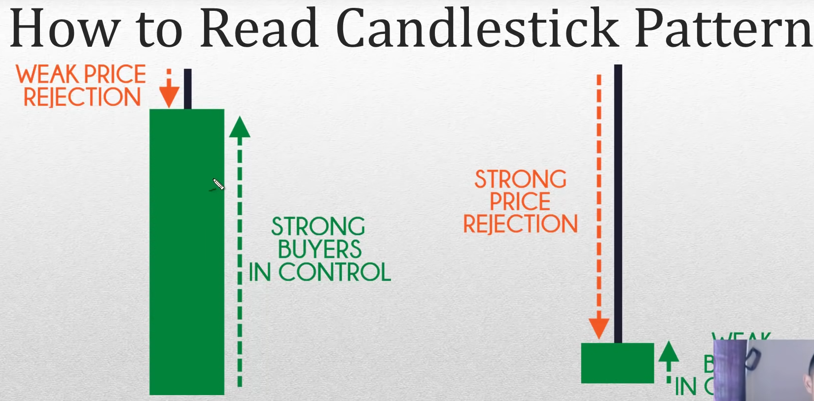

# Analysis
=====

## References

- [Youtube: Technical Analysis for Beginners](https://www.youtube.com/watch?v=rNI166nMAFw)
- [Youtube: Ultimate Technical Analysis Beginner Guide](https://www.youtube.com/watch?v=ttPGkFAROWk)
- [Binance: A Guide to Cryptocurrency Fundamental Analysis](https://academy.binance.com/en/articles/a-guide-to-cryptocurrency-fundamental-analysis)
- [3Commas: Fundamental Analysis in Crypto 101](https://3commastutorials.medium.com/fundamental-analysis-in-crypto-101-fb1ddc9e23df)
- [Investopedia: What is Fundamental Analysis?](https://www.investopedia.com/terms/f/fundamentalanalysis.asp)
- [Investopedia: When to use Fundamental Analysis?](https://www.investopedia.com/ask/answers/050515/it-better-use-fundamental-analysis-technical-analysis-or-quantitative-analysis-evaluate-longterm.asp#:~:text=Fundamental%20analysis%20is%20most%20often,the%20active%20trading%20of%20stocks.)

## Fundamental Analysis ([FA](https://academy.binance.com/en/glossary/fundamental-analysis))

- Trading assets as volatile as [cryptocurrencies](https://academy.binance.com/en/articles/what-is-cryptocurrency) requires some skill
  - [Selecting a strategy](https://academy.binance.com/en/articles/a-beginners-guide-to-cryptocurrency-trading-strategies)
  - [Understanding the vast world of trading](https://academy.binance.com/en/articles/a-complete-guide-to-cryptocurrency-trading-for-beginners)
  - Mastering [technical analysis](https://academy.binance.com/en/articles/what-is-technical-analysis)
  - Mastering [fundamental analysis](https://academy.binance.com/en/articles/what-is-fundamental-analysis-fa)
- [A Guide to Cryptocurrency Fundamental Analysis](https://academy.binance.com/en/articles/a-guide-to-cryptocurrency-fundamental-analysis)
  - What is fundamental analysis (FA)?
  - Categories of crypto FA metrics
    - On-chain metrics
      - [CoinMarketCap's on-chain analysis of Bitcoin](https://coinmarketcap.com/currencies/bitcoin/onchain-analysis/)
      - [Coinmetrics' Data Charts](https://coinmetrics.io/charts/#assets=btc)
      - [Binance Research's project reports](https://research.binance.com/en/projects/bitcoin?utm_source=BinanceAcademy)
      - Transaction count
      - Transaction value
      - Active addresses
      - Fees paid
      - Hash rate and the amount staked
    - Project metrics
      - The whitepaper
        - Open-Source Software ([OSS](https://academy.binance.com/en/glossary/open-source-software-oss))
        - [Coin](https://academy.binance.com/en/glossary/coin)
        - [Token](https://academy.binance.com/en/glossary/token)
      - The team
        - [5 Common Cryptocurrency Scams and How to Avoid Them](https://academy.binance.com/en/articles/5-common-cryptocurrency-scams-and-how-to-avoid-them)
        - [Bitcoin GitHub](https://academy.binance.com/en/glossary/github)
        - Competitors
        - Tokenomics and initial distribution
    - Financial metrics
      - [Market Capitalization](https://academy.binance.com/en/glossary/market-capitalization)
        - [Circulating Supply](https://academy.binance.com/en/glossary/circulating-supply)
        - [Coin Burn](https://academy.binance.com/en/articles/what-is-a-coin-burn)
      - Liquidity and volume
        - [Liquidity](https://academy.binance.com/en/articles/liquidity-explained)
        - [Ask Price](https://academy.binance.com/en/glossary/asking-price)
        - [Bid Price](https://academy.binance.com/en/glossary/bid-price)
        - [Bid-Ask Spread](https://academy.binance.com/en/glossary/bid-ask-spread)
        - [Volume](https://academy.binance.com/en/glossary/volume)
      - Supply mechanisms
        - [Bitcoin and the Stock to Flow Model](https://academy.binance.com/en/articles/bitcoin-and-the-stock-to-flow-model)
        - [Maximum Supply](https://academy.binance.com/en/glossary/maximum-supply)
        - [Circulating Supply](https://academy.binance.com/en/glossary/circulating-supply)
        - [Inflation](https://academy.binance.com/en/articles/what-is-inflation)
        - [HODL](https://academy.binance.com/en/glossary/hodl)
- Fundamental analysis indicators, metrics
  - Combining metrics and creating FA indicators
  - Key FA indicators and metrics
    - Network Value to Transactions Ratio (NVT)
    - Market Value to Realized Value Ratio (MVRV)
  - Stock-to-flow model
  - Crypto Fees
  - Glassnode Studio
  - Closing thoughts
- Tools
  - https://trends.google.com/trends/explore?date=all&geo=US&q=buy%20crypto
  - https://coinmarketcap.com/charts/
  - https://datamish.com/
  - https://coinmetrics.io/charts/#assets=btc
  - https://crypto.com/
  - https://www.theblockcrypto.com/
  - https://dailydefi.org/
  - https://www.v3s.finance/
  - https://coindix.com/

## Technical Analysis ([TA](https://academy.binance.com/en/articles/what-is-technical-analysis))

- Technical analysis (`TA`) - `charting`, is a type of analysis that aims to `predict future market behavior` based on `previous price action` and `volume data`

### 7 Common Mistakes in Technical Analysis ([TA](https://academy.binance.com/en/articles/7-common-mistakes-in-technical-analysis-ta))

1. Not cutting your losses
2. Over trading
3. Revenge trading
4. Being too stubborn to change your mind
5. Ignoring extreme market conditions
6. Forgetting that TA is a game of probabilities
7. Blindly following other traders

### [12 Terms Every Crypto Trader Should Know](https://academy.binance.com/en/articles/12-terms-every-crypto-trader-should-know)

1. Fear, Uncertainty, and Doubt ([FUD](https://academy.binance.com/en/glossary/fear-uncertainty-and-doubt)): Spreading of fear and misinformation to gain an advantage.
2. Fear Of Missing Out ([FOMO](https://academy.binance.com/en/glossary/fear-of-missing-out)): The emotion you feel when you panic buy.
3. [HODL](https://academy.binance.com/en/glossary/hodl): Buy and hold on to it for a long time!
4. BUIDL: Keep your head down and build the next financial system.
5. [SAFU](https://academy.binance.com/en/glossary/secure-asset-fund-for-users): Funds are safe!
6. Return on Investment (ROI): How much money you are making (or losing).
7. All-Time High ([ATH](https://academy.binance.com/en/glossary/all-time-high)): The highest price ever recorded!
8. All-Time Low (ATL): The lowest price ever recorded.
9. Do Your Own Research (DYOR): Don't trust, verify.
10. Due Diligence (DD): Smart people make decisions based on facts.
11. Anti Money Laundering ([AML](https://academy.binance.com/en/glossary/anti-money-laundering)): Regulations that prevent criminals from hiding their money.
12. Know Your Customer ([KYC](https://academy.binance.com/en/glossary/know-your-customer)): Regulations that make exchanges verify your identity.

### Support and Resistance

- [Support](https://academy.binance.com/en/glossary/support)
  - support level
  - the price continually entered an area where the asset was bought up
  - a support range was formed as the area was retested multiple times
  - and since the bears (sellers) were unable to push the price further down, it eventually bounced – potentially starting a new uptrend
  - Price bouncing in an area of support before a breakout
  - 
- [Resistance](https://academy.binance.com/en/glossary/resistance)
  - resistance level
  - the price was in a downtrend, but after each bounce, it failed to break through the same area multiple times
  - the resistance level is formed because the bulls (buyers) were unable to gain control of the market and drive the price higher, causing the downtrend to continue
  - Price unable to break an area of resistance
  - 

### Indicator

- What is an Indicator
  - A tool that takes historical data and apply a formula to it
  - `Summarize` the market price action
  - Useful as an entry trigger, identifying area of value, and understanding market condition
- Common TA indicators
  - Moving Averages (MA)
    - Trade with the trend
    - Area of value
  - Average True Range (ATR)
    - Set a proper Stop loss
    - Volatility Cycle: Identify the market's volatility
  - Donchain Channel
    - Entry Trigger
    - Trend Filter
    - Trailing Stop Loss
  - Moving Averages ([SMA]https://academy.binance.com/en/articles/moving-averages-explained)
    - calculated based on the closing prices of an asset within a set time period
  - Exponential moving average (EMA)
    - a modified version of the SMA that weights recent closing prices more heavily than the older ones
  - Moving average convergence divergence ([MACD](https://academy.binance.com/en/articles/macd-indicator-explained))
    - generated by subtracting two EMAs to create the main line (the MACD line)
    -  The first line is then used to generate another EMA, resulting in a second line (known as the signal line)
    -  The MACD histogram, which is calculated based on the differences between those two lines
  - Bollinger Bands ([BB](https://academy.binance.com/en/articles/bollinger-bands-explained))
    - consists of two lateral bands that flow around a moving average line
  - Relative strength index ([RSI](https://academy.binance.com/en/articles/what-is-the-rsi-indicator))
    - [RSI là gì? Cách sử dụng chỉ báo RSI chuẩn nhất](https://kienthucforex.com/rsi-la-gi/)
    - [RSI là gì? Công thức và cách sử dụng chỉ số RSI hiệu quả](https://soriaforcongress.com/rsi-la-gi/)
    - [RSI là gì? Hướng dẫn 7 cách giao dịch RSI hiệu quả nhất](https://sinvest.vn/rsi-la-gi/)
    - [Chỉ Số RSI Là Gì? Cách Ứng Dụng Chỉ Số RSI Trong Phân Tích Đầu Tư Chứng Khoán](https://24hmoney.vn/news/chi-so-rsi-la-gi-cach-ung-dung-chi-so-rsi-trong-phan-tich-dau-tu-chung-khoan-c1a1306634.html)
  - Stochastic RSI ([S-RSI]https://academy.binance.com/en/articles/stochastic-rsi-explained)
    - calculated by applying a mathematical formula to the regular RSI
    - [Stochastic RSI là gì ? Cách dùng Stochastic RSI hiệu quả](https://www.lekimdung.com/stochastic-rsi)
    - [ Stochastic RSI: Hệ Thống Giao Dịch Với Stochatic RSI](https://tradafx.net/stochastic-rsi-la-gi-627.html)
  - [Connors RSI (CRSI)](https://vn.tradingview.com/support/solutions/43000502017/)
- [5 Essential Indicators Used in Technical Analysis](https://academy.binance.com/en/articles/5-essential-indicators-used-in-technical-analysis)

### Drawing tools

- What are Drawing tools
  - Trend-line
  - Trend-channel
  - Support and Resistance
  - Useful to find area of value to trade from (by low and sell high)
- How to Drawing Correctly
  - Zoom out
    - 400 channel
    - Reset chart
    - Ctl + scroll mouse down (5)
  - Draw most obvious levels
  - Adjust to get the most touches

### Candlestick Patterns

- What is a Candlestick Pattern
  - 
  - A method of reading price chart (using OHLC)
  - Open High Low and Close
  - Useful as an entry trigger
- How to Read Candlestick Pattern
  - 
- Powerful Candlestick Pattern
  - Engulfing Pattern
    - 
  - Hammer and Shooting Star
    - 
  - Morning and Evening Star Pattern
    - 
- [12 Popular Candlestick Patterns Used in Technical Analysis](https://academy.binance.com/en/articles/beginners-candlestick-patterns)

### Chart Patterns

- What is a Chart Pattern
  - Quick assessment of the strength, weakness, or equilibrium in the market
  - Useful as an entry trigger and understanding market condition
- Common Chart Patterns
  - Triangle Pattern
    - 
  - Flag Pattern
    - 
  - Head and Shoulders Pattern
    - 

### Market Structure

- Uptrend: series of higher highs and lows
- Downtrend: series of lower highs and lows
- Range: the price contained within the highs and lows (stuck in a box)
