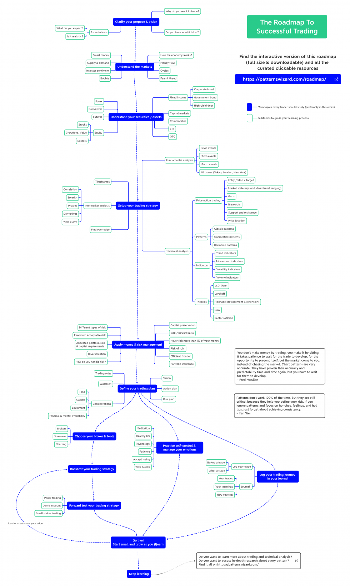

# Road-map to Trading — From Beginner to Expert
============

## Books

- TODO::

## References

- [A Roadmap to Trading — From Beginner to Expert (Part 1 — The Basics)](https://medium.com/@DeFi_Waifu/a-roadmap-to-trading-from-beginner-to-advanced-part-1-the-basics-1dfc7e505d6f)
- [Roadmap to Trading — From Beginner to Expert (Part 2 — Patterns)](https://medium.com/@DeFi_Waifu/roadmap-to-trading-from-beginner-to-expert-part-2-patterns-804cb33f35c8)
- List of YouTube channels with good information
  - [MoneyZG](https://www.youtube.com/channel/UCIEvlRpHBVFthrF6pZzBEXw)
  - [Rayner Teo](https://www.youtube.com/channel/UCFSn-h8wTnhpKJMteN76Abg)
  - [Trading Beacon](https://www.youtube.com/channel/UCDSBQnqFvO6h3CDCSWkyZCg/videos)
  - [Trading Rush](https://www.youtube.com/c/TRADINGRUSH/videos)
  - [Humbled Trader](https://www.youtube.com/channel/UCcIvNGMBSQWwo1v3n-ZRBCw)
  - [Warrior Trading](https://www.youtube.com/channel/UCBayuhgYpKNbhJxfExYkPfA)

## Tools

- [TradingView - Paper Trading](https://www.tradingview.com/support/solutions/43000516466-paper-trading-main-functionality/)

## Basics
=====

### [Understanding the Market](./1_understanding-the-market/README.md)

- [x] Binance: The Psychology of Market Cycles
- [x] Binance: What is Crypto Market Sentiment?
- [x] Technical analysis indicator
- [x] The 5 Major Cryptocurrency Market Cycles

### Order Types

#### Beginner

- [Binance: What Is a Market Order?](https://academy.binance.com/en/articles/what-is-a-market-order)
- [Binance: What Is a Limit Order?](https://academy.binance.com/en/articles/what-is-a-limit-order)
- [Binance: What is a Stop Limit Order?](https://academy.binance.com/en/articles/what-is-a-stop-limit-order)

#### Advanced

- [Binance: Understanding Different Order Types](https://academy.binance.com/en/articles/understanding-the-different-order-types)
- [Binance: What Is an OCO Order?](https://academy.binance.com/en/articles/what-is-an-oco-order)

### Order Book

- [Youtube: What is an order book?](https://www.youtube.com/watch?v=u9RIA1uUbAs)

### Basic Technical Analysis

##### Beginner

- [Binance: What is Technical Analysis?](https://academy.binance.com/en/articles/what-is-technical-analysis)
- [Binance: 12 Terms any Crypto Trader Should Know](https://academy.binance.com/en/articles/12-terms-every-crypto-trader-should-know)
- [Binance: A Complete Guide To Cryptocurrency Trading for Beginners](https://academy.binance.com/en/articles/a-complete-guide-to-cryptocurrency-trading-for-beginners)
- [Binance: 7 Common Mistakes in Technical Analysis](https://academy.binance.com/en/articles/7-common-mistakes-in-technical-analysis-ta)
- [Youtube: Technical Analysis for Beginners](https://www.youtube.com/watch?v=rNI166nMAFw)

#### Advanced

- [Youtube: Ultimate Technical Analysis Beginner Guide](https://www.youtube.com/watch?v=ttPGkFAROWk)

### Fundamental Analysis

#### Beginner

- [Binance: A Guide to Cryptocurrency Fundamental Analysis](https://academy.binance.com/en/articles/a-guide-to-cryptocurrency-fundamental-analysis)
- [3Commas: Fundamental Analysis in Crypto 101](https://3commastutorials.medium.com/fundamental-analysis-in-crypto-101-fb1ddc9e23df)

#### Advanced

- [Investopedia: What is Fundamental Analysis?](https://www.investopedia.com/terms/f/fundamentalanalysis.asp)
- [Investopedia: When to use Fundamental Analysis?](https://www.investopedia.com/ask/answers/050515/it-better-use-fundamental-analysis-technical-analysis-or-quantitative-analysis-evaluate-longterm.asp#:~:text=Fundamental%20analysis%20is%20most%20often,the%20active%20trading%20of%20stocks.)

### TradingView

#### Beginners

- [Binance: A Beginners Guide To TradingView](https://academy.binance.com/en/articles/a-beginner-s-guide-to-tradingview)

#### Advanced

- [Youtube: From TradingView Beginner to Expert](https://www.youtube.com/watch?v=iENn5rBHIAo)

### Practice

1. Set up an exchange account (if you don’t have one already). I would recommend Binance for anyone outside the US. Once that’s done, start looking at the order book and order types (without making actual orders).
2. Set up a TradingView account and looking at charts. It doesn’t matter if you don’t understand much, try to get more familiar with the TradingView interface. Change your time frame, change your pairs (for example, BTC/USD, ETH/USD), and so on. Add a few indicators to see how they work.
3. Start finding some Crypto news websites that you trust and bookmark them. Check them once or twice a day and keep up to speed with developments in the Crypto world.
4. Below is a list of Youtube channels with good information. Follow these channels and watch some video’s if you’re up for it!

## Patterns
=====

### Basic Techniques

#### Beginner

- [Binance: The Basics of Support and Resistance Explained](https://academy.binance.com/en/articles/the-basics-of-support-and-resistance-explained)
- [Binance: Trend Lines Explained](https://academy.binance.com/en/articles/trend-lines-explained)
- [Youtube: Trend Lines & Channels](https://www.youtube.com/watch?v=jN4R2jeCRsg)
- [Investopedia: What is a pullback?](https://www.investopedia.com/terms/p/pullback.asp)
- [Investopedia: What is a breakout?](https://www.investopedia.com/terms/b/breakout.asp)

#### Advanced

- [Investopedia: Introduction to Technical Analysis Price Patterns](https://www.investopedia.com/articles/technical/112601.asp)
- [TradingView: Drawing Tools](https://www.tradingview.com/support/folders/43000547459-i-d-like-to-learn-more-about-various-drawing-tools/)
- [TradingView: Hotkeys](https://www.tradingview.com/support/folders/43000561752-hotkeys-and-tips/)
- [Youtube: Charting Secrets](https://www.youtube.com/watch?v=F66I-aP8gqU)

### Candlestick Patterns

#### Beginner

- [Binance: A Beginners Guide to Candlestick Charts](https://academy.binance.com/en/articles/a-beginners-guide-to-candlestick-charts)
- [Binance: 12 Popular Candlestick Patterns Used In Technical Analysis](https://academy.binance.com/en/articles/beginners-candlestick-patterns)
- [Youtube: Ultimate Candlestick Trading Course](https://www.youtube.com/watch?v=C3KRwfj9F8Q)
- [Youtube: Candlestick Patterns Cheat Sheet](https://www.youtube.com/watch?v=prLn423Su3g)

#### Advanced

- [Investopedia: The 5 Most Powerful Candlestick Patterns](https://www.investopedia.com/articles/active-trading/092315/5-most-powerful-candlestick-patterns.asp)

### Classic Patterns

#### Rules

1. The more isolated a pattern is vertically, the greater its reliability.
2. The overwhelming vast majority of patterns will fail.
3. Patterns on intraday graphs are even more susceptible to failure.
4. Patterns on weekly charts are the most reliable.
5. Horizontal patterns are far more reliable than diagonal patterns.

#### Beginner

- [Binance: A Beginners Guide to Classical Chart Patterns](https://academy.binance.com/en/articles/a-beginners-guide-to-classical-chart-patterns)
- [Youtube: Understanding Chart Patterns for Online Trading](https://www.youtube.com/watch?v=o6hZma0bajE)
- [Binance: The Basics of Support and Resistance Explained](https://academy.binance.com/en/articles/the-basics-of-support-and-resistance-explained)
- [Binance: Bollinger Bands Explained (optional)](https://academy.binance.com/en/articles/bollinger-bands-explained)
- [Youtube: Head and Shoulders Pattern](https://www.youtube.com/watch?v=T5uZqbbJIdk)
- [Youtube: Understanding Triangle Chart Patterns](https://www.youtube.com/watch?v=lzTZK96cWSU)
- [Youtube: How to Trade the Double Top Pattern](https://www.youtube.com/watch?v=DF9uHpbb5Z8) (this also applies to double bottom, except reverse. Price is expected to go up after double bottom).
- [Youtube: Trading M-Tops and W-Bottoms](https://www.youtube.com/watch?v=8cXh8McPEk8)
- [Youtube: How to Trade Flags and Pennant Patterns](https://www.youtube.com/watch?v=czYOKi8MXto)
- [Youtube: Diamond Tops & Diamond Bottoms](https://www.youtube.com/watch?v=dqOkNOB_VlI)
- [Youtube: Wedges](https://www.youtube.com/watch?v=owdDeZbJvFo)
- [Youtube: Trading the Cup and Handle Pattern](https://www.youtube.com/watch?v=dH_Ty-Digfk)

#### Advanced

- [Youtube: My 3 Favorite Chart Patterns](https://www.youtube.com/watch?v=V9cWJpBKaMg)
- [Youtube: How to Trade the Complex Pullback](https://www.youtube.com/watch?v=MP_8RGmfxqU)

### Harmonic Patterns

- Do not use harmonic patterns, because they try to predict the future.

#### Beginner

- [Investopedia: Harmonic Patterns in the Currency Markets](https://www.investopedia.com/articles/forex/11/harmonic-patterns-in-the-currency-markets.asp)
- [Youtube: Harmonic Patterns](https://www.youtube.com/watch?v=pzjjlcse6zU)

### Practice

1. Starting looking at charts. First, determine the overall trend. Is it in an uptrend, or a downtrend? Use trend lines on the 1-day chart.
2. After you’ve established the overall trend, try to find patterns on 1-day charts. Look at both candle sticks and classic patterns. Is there anything interesting you can spot? How long did it take for these patterns to form?
3. What was the result? Example, if you found a descending triangle during a downtrend, did the trend continue like is often expected? Document your findings and move on to the next pattern.
4. Repeat for any number of times, and try it out with different pairs and different time frames. Do you see a decrease in accuracy when you switch to a 1-hour time frame, par example? An increase when you switch to a weekly time frame?
5. Try to find patterns that are currently still being played out, write down what you think will happen based on what you know, and keep an eye on them for a the next few days. Once you get your answer, evaluate your predictions and if they were correct or incorrect.
